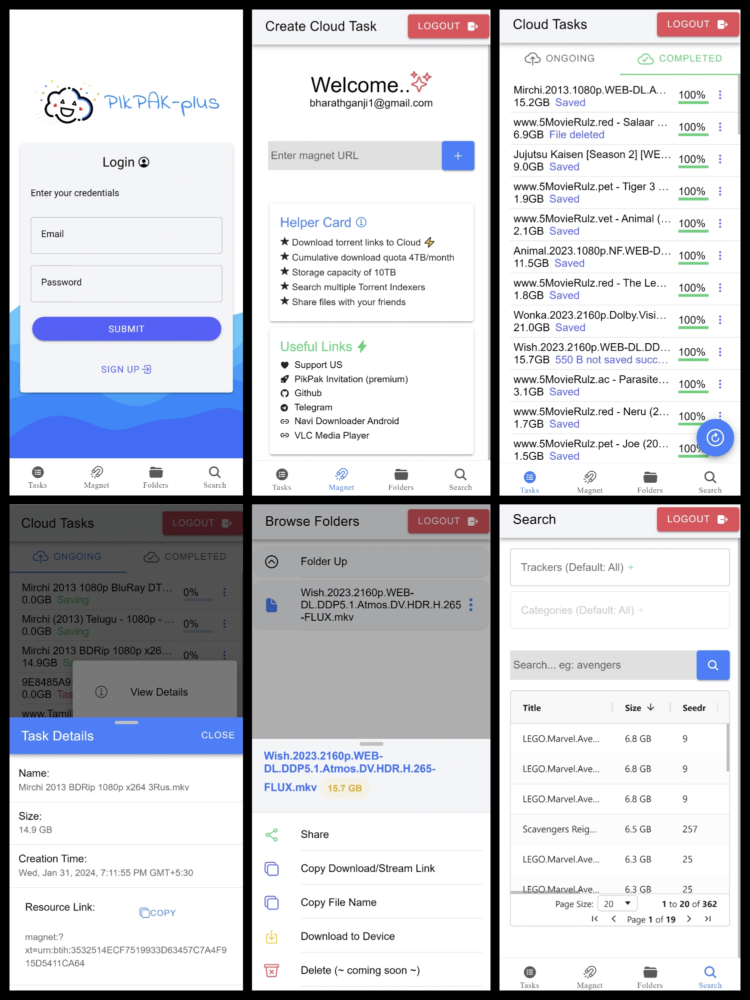
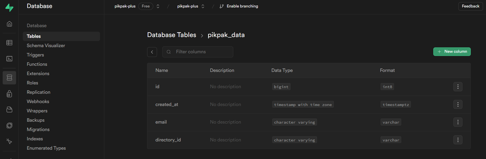

[![Contributors][contributors-shield]][contributors-url]
[![Forks][forks-shield]][forks-url]
[![Stargazers][stars-shield]][stars-url]
[![Issues][issues-shield]][issues-url]
[![LinkedIn][linkedin-shield]][linkedin-url]

<br />

<p align="center">
  <a href="https://github.com/bharathganji/pikpak-plus/">
    
  </a>

  <h3 align="center">unofficial implementation of <a href='https://mypikpak.com/drive/activity/invited?invitation-code=47295398'> PikPak </a>
  </h3>

  <p align="center">
    Share your PikPak [Premium] with your friends and family!
    <br />
    <a href="https://github.com/bharathganji/pikpak-plus"><strong>Explore the docs »</strong></a>
    <br />
    <br />
    <a href="">Installation Demo (coming soon)</a>
    ·
    <a href="https://github.com/bharathganji/pikpak-plus/issues">Report Bug</a>
    ·
    <a href="https://github.com/bharathganji/pikpak-plus/issues">Request Feature</a>
  </p>
</p>

<details open="open">
  <summary>Table of Contents</summary>
  <ol>
    <li>
      <a href="#about-the-project">About The Project</a>
      <ul>
        <li><a href="#built-with">Built With</a></li>
      </ul>
    </li>
    <li>
      <a href="#getting-started">Getting Started</a>
      <ul>
        <li><a href="#prerequisites">Prerequisites</a></li>
        <li><a href="#installation">Installation</a></li>
      </ul>
    </li>
    <li><a href="#usage">Usage</a></li>
    <li><a href="#roadmap">Roadmap</a></li>
    <li><a href="#contributing">Contributing</a></li>
    <li><a href="#license">License</a></li>
    <li><a href="#contact">Contact</a></li>
    <li><a href="#acknowledgements">Acknowledgements</a></li>
  </ol>
</details>

<!-- ABOUT THE PROJECT -->

## About The Project

**Note:**

- This project started as a personal project to learn about docker and python flask. This was my first time working with flask so the code might not be the best, I have certainly learned a lot from this project and maintaining or updating it is just too much work for me, so I have decided to open source it.

- I have been using [PikPak](https://mypikpak.com/drive/activity/invited?invitation-code=47295398) for a long time now and it's great service available for affordable price, but I always felt that i haven't used atleast minimum 10% of montly quota available, I wanted to be share my account with and friends so, collectively we can use it to it's maximum potential, so I decided to build this application.

- I may or maynot updating this project in future, but I have plans to enhance if i find any bugs, I have used using [React](https://react.dev/) + [Vitejs](https://vitejs.dev/) + [IonicFramework](https://ionicframework.com/) for the frontend, [Flask](https://flask.palletsprojects.com/) for the backend with [supabase](https://supabase.com/) for authentication and supabase(mySQL) for the database.

- This project do not store any passwords from users and tried to provide authentication to its atmost possible.

- IonicFramework is used by keeping in mind to implement cross platform applications but due to technical difficulties with vitejs and kind of poor archtecture (learner) it was kept of hold.

- [jackett](https://github.com/Jackett/Jackett/) was used for (pikpak-plus.com/search) searching torrents and i found this was the limitation with pikpak and try tried to enhance this feature as much as possible.



Download Drawback:

- During download we wont be receiving filename via content disposition request response, it will store as download.bin file. so, we need a blob mechanism to store it with custom file name.

solution:

1. Rename the file after download (already an action provided to click and copy file/folder name).
2. use 3rd party downloaders, provide the link and name and start download. (IDM, ADM, [NAVI](https://github.com/TachibanaGeneralLaboratories/download-navi/releases/), etc...).

### Built With

The application is containarized so that you don't need to go through the hassle of installing dependencies, tech stack used to built this application is listed below.

- [React.js](https://reactjs.org/)
- [Vitejs](https://vitejs.dev/)
- [IonicFramework](https://ionicframework.com/)
- [Python Flask](https://flask.palletsprojects.com/en/)
- [supabase](https://supabase.com/)
- [Docker](https://www.docker.com/)

<!-- GETTING STARTED -->

## Getting Started

This project is focused to run on server environment hence docker containers are used to deploy the application.

### Prerequisites

- [Docker](https://docs.docker.com/get-docker/)
- [docker-compose](https://docs.docker.com/compose/install/)

### Installation

1. Clone the repo

   ```
   git clone https://github.com/bharathganji/pikpak-plus.git
   ```

2. Create `.env` file inside the project root folder, add the following to it (refer `example.env`)

   ```
   # pikpak email, password (Required)
   user = example@example.com
   passwd = example

   # Supabse Project URL, anon public-key (Required)
   SUPABASE_URL = https://example.supabase.co
   SUPABASE_KEY = example string key

   # Jackett API key and domain (optional)
   # if you want to use search Functionality (Required)
   JACKETT_API_KEY = string key
   JACKET_DOMAIN = https://jackett.example

   # api hostname/URL if deployed external else dont change eg:'https://api.example.com/'
   VITE_PIKPAK_PLUS_API = 'http://server:5000'

   # UI Domain Name (optional)
   VITE_HOSTNAME = 'https://example.com'

   # Ports (optional)
   VITE_DEVELOPMENT_PORT = "3001"
   VITE_PRODUCTION_PORT = "3002"
   ```

3. Create Table and enable RLS policies in supabase

   <div align="center"> 
    
    
   </div>

4. Run the containers

   ```JS
   sudo docker compose -f "docker-compose.yml" up -d --build
   ```

<!-- USAGE EXAMPLES -->

## Usage

- sign-up with email and password, check your inbox and verify email
- sign-in and try out all features

<!-- ROADMAP -->

## Roadmap

See the [open issues](https://github.com/bharathganji/pikpak-plus/issues) for a list of proposed features (and known issues).

<!-- CONTRIBUTING -->

## Contributing

Contributions are what make the open source community such an amazing place to be learn, inspire, and create. Any contributions you make are **greatly appreciated**.

1. Fork the Project
2. Create your Feature Branch (`git checkout -b feature/AmazingFeature`)
3. Commit your Changes (`git commit -m 'Add some AmazingFeature'`)
4. Push to the Branch (`git push origin feature/AmazingFeature`)
5. Open a Pull Request

<!-- LICENSE -->

## License

Distributed under the GNU General Public License v3.0. See [LICENSE](LICENSE.txt) for more information.

<!-- CONTACT -->

## Contact

Bharath Ganji - [@bharathganji](https://in.linkedin.com/in/bharath-ganji-912556194) - <bharathganji1@gmail.com>

Project Link: [https://github.com/bharathganji/pikpak-plus](https://github.com/bharathganji/pikpak-plus)

<!-- ACKNOWLEDGEMENTS -->

## Acknowledgements

- https://github.com/sudozid/jackett-metasearch-flask
- https://github.com/n-wall/pikpak/

<!-- MARKDOWN LINKS & IMAGES -->
<!-- https://www.markdownguide.org/basic-syntax/#reference-style-links -->

[contributors-shield]: https://img.shields.io/github/contributors/bharathganji/pikpak-plus.svg?style=for-the-badge
[contributors-url]: https://github.com/bharathganji/pikpak-plus/graphs/contributors
[forks-shield]: https://img.shields.io/github/forks/bharathganji/pikpak-plus.svg?style=for-the-badge
[forks-url]: https://github.com/bharathganji/pikpak-plus/network/members
[stars-shield]: https://img.shields.io/github/stars/bharathganji/pikpak-plus.svg?style=for-the-badge
[stars-url]: https://github.com/bharathganji/pikpak-plus/stargazers
[issues-shield]: https://img.shields.io/github/issues/bharathganji/pikpak-plus.svg?style=for-the-badge
[issues-url]: https://github.com/bharathganji/pikpak-plus/issues
[license-shield]: https://img.shields.io/github/license/bharathganji/pikpak-plus.svg?style=for-the-badge
[license-url]: https://github.com/bharathganji/pikpak-plus/blob/master/LICENSE.txt
[linkedin-shield]: https://img.shields.io/badge/-LinkedIn-black.svg?style=for-the-badge&logo=linkedin&colorB=555
[linkedin-url]: https://www.linkedin.com/in/bharath-ganji-912556194
