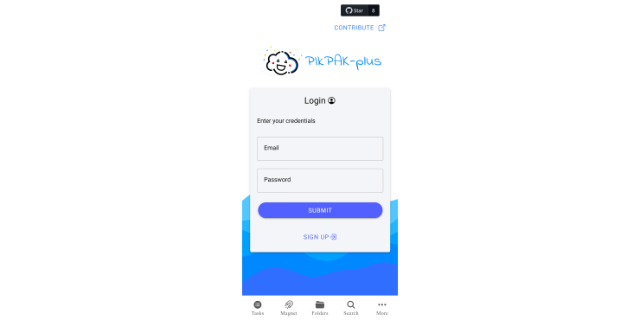

[![Contributors][contributors-shield]][contributors-url]
[![Forks][forks-shield]][forks-url]
[![Stargazers][stars-shield]][stars-url]
[![Issues][issues-shield]][issues-url]
[![LinkedIn][linkedin-shield]][linkedin-url]

<br />

<p align="center">
  <a href="https://github.com/bharathganji/pikpak-plus/">
    
  </a>

  <h3 align="center">unofficial implementation of <a href='https://mypikpak.com/drive/activity/invited?invitation-code=47295398'> PikPak </a>
  </h3>

  <p align="center">
    Share your PikPak [Premium] with your friends and family!
    <br />
    <a href="https://github.com/bharathganji/pikpak-plus"><strong>Explore the docs »</strong></a>
    <br />
    <br />
    <a href="">Installation Demo (coming soon)</a>
    ·
    <a href="/pikpak-plus-client/android/app/release/">Android Apk</a>
    ·
    <a href="https://github.com/bharathganji/pikpak-plus/issues">Report Bug</a>
    ·
    <a href="https://github.com/bharathganji/pikpak-plus/issues">Request Feature</a>
  </p>
</p>

<details open="open">
  <summary>Table of Contents</summary>
  <ol>
    <li>
      <a href="#about-the-project">About The Project</a>
      <ul>
        <li><a href="#built-with">Built With</a></li>
      </ul>
    </li>
    <li>
      <a href="#getting-started">Getting Started</a>
      <ul>
        <li><a href="#prerequisites">Prerequisites</a></li>
        <li><a href="#installation">Installation</a></li>
      </ul>
    </li>
    <li><a href="#usage">Usage</a></li>
    <li><a href="#roadmap">Roadmap</a></li>
    <li><a href="#contributing">Contributing</a></li>
    <li><a href="#license">License</a></li>
    <li><a href="#contact">Contact</a></li>
    <li><a href="#acknowledgements">Acknowledgements</a></li>
  </ol>
</details>

<!-- ABOUT THE PROJECT -->

## About The Project

**PikPak Plus** is an unofficial web application that enhances the [PikPak](https://mypikpak.com/drive/activity/invited?invitation-code=47295398) cloud storage experience by enabling easy sharing of your PikPak Premium account with friends and family. Built with modern web technologies, it provides a seamless interface for managing downloads, creating share links, and generating WebDAV clients.

### Key Features

- 🔐 **Secure Authentication**: Uses Supabase for user authentication without storing PikPak passwords
- 📥 **Task Management**: Create and monitor download tasks with real-time status updates
- 🔗 **Smart Share Links**: Global share deduplication ensures one link per file, reused by all users
- 📁 **WebDAV Support**: Auto-generate WebDAV clients for easy access from any WebDAV-compatible application
- 🗑️ **Auto Cleanup**: Automated task cleanup after 24 hours to maintain account hygiene
- 📊 **Quota Monitoring**: Real-time tracking of storage and bandwidth usage
- 📈 **Statistics Dashboard**: Track daily usage metrics including tasks added, storage utilization, cloud download usage, and downstream traffic with interactive charts
- ⚡ **Performance**: Redis caching for faster API responses
- 🎨 **Modern UI**: Built with Next.js, React 19, and Tailwind CSS for a premium user experience
- 📱 **Responsive Design**: Works seamlessly across desktop and mobile devices

### Architecture

**Frontend**: Modern [Next.js](https://nextjs.org/) application with React 19, TypeScript, and Tailwind CSS

**Backend**: Modular Python Flask application with:

- **API Layer**: RESTful endpoints for tasks, shares, WebDAV, and quota management
- **Services Layer**: Dedicated services for PikPak, Supabase, and WebDAV operations
- **Task Scheduler**: Automated jobs for task status updates, cleanup, and WebDAV generation
- **Caching**: Redis-based caching for improved performance

**Database**: Supabase (PostgreSQL) for user data and task management

**Deployment**: Docker Compose with internal networking for enhanced security

### Security & Privacy

- No PikPak passwords are stored; authentication is handled via Supabase
- Internal Docker networking keeps the Flask server unexposed
- Row-level security (RLS) policies in Supabase ensure data isolation

### Built With

The application is containerized with Docker for easy deployment. The tech stack includes:

**Frontend**:

- [Next.js 16](https://nextjs.org/) - React framework with server-side rendering
- [React 19](https://react.dev/) - UI library
- [TypeScript](https://www.typescriptlang.org/) - Type-safe JavaScript
- [Tailwind CSS 4](https://tailwindcss.com/) - Utility-first CSS framework
- [Radix UI](https://www.radix-ui.com/) - Accessible component primitives
- [Lucide React](https://lucide.dev/) - Beautiful icon library
- [Recharts](https://recharts.org/) - Composable charting library

**Backend**:

- [Python Flask 3.0](https://flask.palletsprojects.com/) - Web framework
- [Gunicorn](https://gunicorn.org/) - WSGI HTTP server
- [APScheduler](https://apscheduler.readthedocs.io/) - Task scheduling
- [Redis](https://redis.io/) - In-memory caching
- [httpx](https://www.python-httpx.org/) - Async HTTP client

**Database & Auth**:

- [Supabase](https://supabase.com/) - PostgreSQL database with authentication

**DevOps**:

- [Docker](https://www.docker.com/) - Containerization
- [Docker Compose](https://docs.docker.com/compose/) - Multi-container orchestration

<!-- GETTING STARTED -->

## Getting Started

This project is designed to run in a containerized environment using Docker Compose, making deployment simple and consistent across different platforms.

### Prerequisites

- [Docker](https://docs.docker.com/get-docker/) (version 20.10 or higher)
- [Docker Compose](https://docs.docker.com/compose/install/) (version 2.0 or higher)
- A [Supabase](https://supabase.com/) account (free tier works)
- A [PikPak Premium](https://mypikpak.com/drive/activity/invited?invitation-code=47295398) account

### Installation

1. **Clone the repository**

   ```bash
   git clone https://github.com/bharathganji/pikpak-plus.git
   cd pikpak-plus
   ```

2. **Configure environment variables**

   Create a `.env` file in the project root (copy from `example.env`):

   ```bash
   cp example.env .env
   ```

   Edit `.env` with your credentials:

   ```ini
   # PikPak Credentials (Required)
   user=your_pikpak_email@example.com
   passwd=your_pikpak_password

   # Supabase Configuration (Required)
   SUPABASE_URL=https://your-project.supabase.co
   SUPABASE_KEY=your_supabase_anon_key

   # Optional: File Size Limit (in GB)
   MAX_FILE_SIZE_GB=25

   # Optional: Task Scheduler Configuration
   TASK_STATUS_UPDATE_INTERVAL_MINUTES=15
   CLEANUP_INTERVAL_HOURS=24
   TASK_RETENTION_HOURS=24

   # Optional: Cache Configuration
   TASK_CACHE_TTL_SECONDS=300
   QUOTA_CACHE_TTL_SECONDS=10800

   # Optional: WebDAV Configuration
   WEBDAV_GENERATION_INTERVAL_HOURS=24

   # Redis Configuration (automatically configured in Docker)
   REDIS_URL=redis://redis:6379/0
   ```

3. **Set up Supabase database**

   Create the required tables in your Supabase project:
   - Navigate to the SQL Editor in your Supabase dashboard
   - Run the SQL script from `pikpak-plus-server/supabase_schema.sql`
   - Enable Row Level Security (RLS) policies as shown in the schema

   Alternatively, use the automated setup script:

   ```bash
   cd pikpak-plus-server
   python setup_supabase.py
   ```

4. **Build and run the containers**

   ```bash
   docker compose up -d --build
   ```

   This will start three services:
   - **web**: Next.js frontend (accessible at `http://localhost:3000`)
   - **server**: Flask backend (internal only, proxied through Next.js)
   - **redis**: Redis cache server

5. **Access the application**

   Open your browser and navigate to `http://localhost:3000`

### Development Setup

For local development without Docker:

**Frontend**:

```bash
cd pikpak-plus-client
npm install
npm run dev
```

**Backend**:

```bash
cd pikpak-plus-server
python -m venv venv
source venv/bin/activate  # On Windows: venv\Scripts\activate
pip install -r requirements.txt
python run.py
```

See [DOCKER.md](DOCKER.md) for detailed Docker configuration and troubleshooting.

## Overview

### Features

#### 📥 Download Management

- Navigate to the **Download** tab
- Paste a magnet link to create a download task
- Monitor task progress with real-time status updates
- Tasks are automatically cleaned up after 24 hours

#### 🔗 Create & Share

- Browse your PikPak files in the **Create and Share** tab
- Click on any file to create a shareable link
- Share links are globally deduplicated (one link per file, reused by all users)
- Links expire after 24 hours for security

#### 📁 WebDAV Access

- Go to the **WebDAV** tab to view your WebDAV clients
- New clients are automatically generated every 24 hours
- Use the credentials with any WebDAV-compatible application:
  - **Windows**: Map Network Drive
  - **macOS**: Finder → Go → Connect to Server
  - **Linux**: Mount via davfs2
  - **Mobile**: Apps like Solid Explorer, FE File Explorer

#### 📊 Quota Monitoring

- View real-time storage and bandwidth usage in the **Quota** tab
- Track download/upload limits
- Monitor VIP status and expiration

#### 📈 Statistics Dashboard

- Access the **Statistics Dashboard** via the bar chart icon in the header
- View historical usage trends with interactive charts:
  - **Tasks Added**: Daily count of download tasks created
  - **Storage Utilization**: Track how your storage usage changes over time
  - **Cloud Download Usage**: Monitor transfer quota consumption (offline downloads)
  - **Downstream Traffic**: Track streaming/playback bandwidth usage
- Data is collected automatically every 24 hours
- View up to 30 days of historical statistics
- Responsive charts that work on both desktop and mobile

#### 👤 My Activity

- View your download history
- Track created share links

### Tips

- **File Size Limit**: By default, files larger than 25GB are blocked. Adjust `MAX_FILE_SIZE_GB` in `.env` to change this.
- **Scheduler**: The application runs automated tasks for status updates, cleanup, and WebDAV generation. Check the UI for countdown timers.

<!-- ROADMAP -->

## Roadmap

See the [open issues](https://github.com/bharathganji/pikpak-plus/issues) for a list of proposed features (and known issues).

<!-- CONTRIBUTING -->

## Contributing

Contributions are what make the open source community such an amazing place to be learn, inspire, and create. Any contributions you make are **greatly appreciated**.

1. Fork the Project
2. Create your Feature Branch (`git checkout -b feature/AmazingFeature`)
3. Commit your Changes (`git commit -m 'Add some AmazingFeature'`)
4. Push to the Branch (`git push origin feature/AmazingFeature`)
5. Open a Pull Request

<!-- LICENSE -->

## License

Distributed under the GNU General Public License v3.0. See [LICENSE](LICENSE.txt) for more information.

<!-- CONTACT -->

## Contact

Bharath Ganji - [@bharathganji](https://in.linkedin.com/in/bharath-ganji-912556194) - <bharathganji1@gmail.com>

Project Link: [https://github.com/bharathganji/pikpak-plus](https://github.com/bharathganji/pikpak-plus)

<!-- ACKNOWLEDGEMENTS -->

## Acknowledgements

- <https://github.com/Quan666/PikPakAPI>
- <https://github.com/sudozid/jackett-metasearch-flask>
- <https://github.com/n-wall/pikpak/>

<!-- MARKDOWN LINKS & IMAGES -->
<!-- https://www.markdownguide.org/basic-syntax/#reference-style-links -->

[contributors-shield]: https://img.shields.io/github/contributors/bharathganji/pikpak-plus.svg?style=for-the-badge
[contributors-url]: https://github.com/bharathganji/pikpak-plus/graphs/contributors
[forks-shield]: https://img.shields.io/github/forks/bharathganji/pikpak-plus.svg?style=for-the-badge
[forks-url]: https://github.com/bharathganji/pikpak-plus/network/members
[stars-shield]: https://img.shields.io/github/stars/bharathganji/pikpak-plus.svg?style=for-the-badge
[stars-url]: https://github.com/bharathganji/pikpak-plus/stargazers
[issues-shield]: https://img.shields.io/github/issues/bharathganji/pikpak-plus.svg?style=for-the-badge
[issues-url]: https://github.com/bharathganji/pikpak-plus/issues
[linkedin-shield]: https://img.shields.io/badge/-LinkedIn-black.svg?style=for-the-badge&logo=linkedin&colorB=555
[linkedin-url]: https://www.linkedin.com/in/bharath-ganji-912556194

## Automated Release Process

This project uses automated releases with conventional commits. Here's how to properly format your commits and trigger releases:

### Commit Format

All commits should follow the conventional commit format:

```

<type>[optional scope]: <description>

[optional body]

[optional footer(s)]

```

### Commit Types

- `feat`: A new feature (triggers minor version bump)
- `fix`: A bug fix (triggers patch version bump)
- `perf`: Performance improvements (triggers patch version bump)
- `docs`: Documentation changes (triggers patch version bump)
- `style`: Code style changes (triggers patch version bump)
- `refactor`: Code refactoring (triggers patch version bump)
- `test`: Adding or modifying tests (triggers patch version bump)
- `build`: Build system changes (triggers patch version bump)
- `ci`: CI configuration changes (triggers patch version bump)
- `chore`: Other changes (triggers patch version bump)
- `revert`: Reverting a previous commit (triggers patch version bump)

### Breaking Changes

To trigger a major version bump, include a breaking change in your commit:

```

feat: add new API implementation

BREAKING CHANGE: The old API endpoints have been removed

```

### Release Process

1. Make sure your commits follow the conventional format
2. Push your changes to the `main` branch to trigger an automated release
3. The system will automatically:
   - Determine the new version based on commit types
   - Update both client and server package versions
   - Generate release notes
   - Create a GitHub release
   - Tag the release with the new version

### Pre-releases

For beta releases, push to the `beta` branch. For alpha releases, push to the `alpha` branch.

```

```
